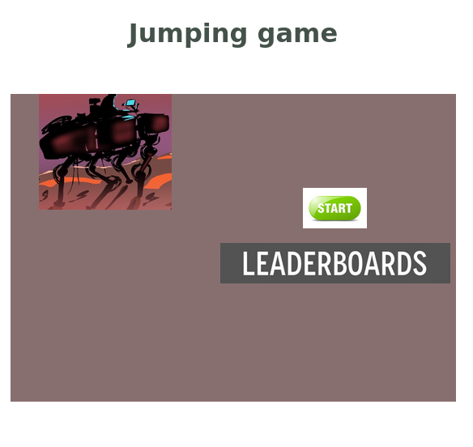
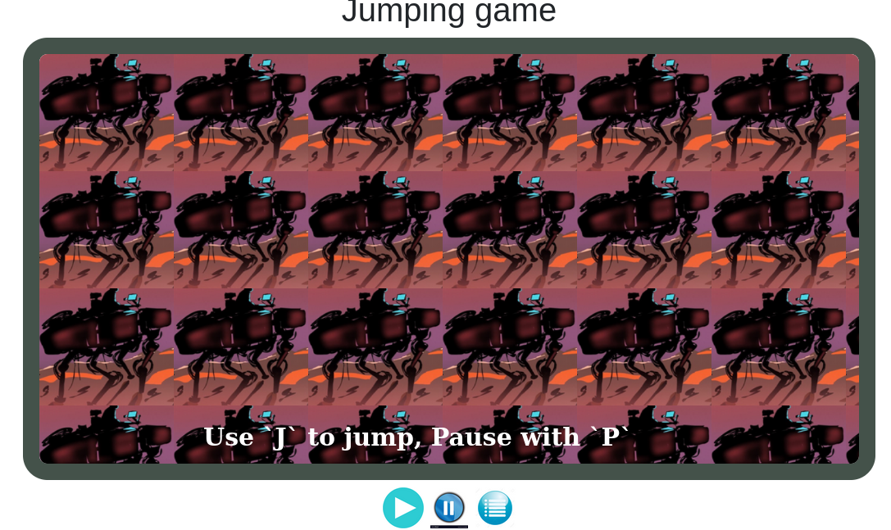

# Platform Game (name: Jumping Game)

This Game is built with HTML5, JAVASCRIPT and PHASER 3 and It is only compatible with screen bigger than 1024W at the moment. 

The goal is to try to go through the Objects without hitting any of them.

Controls are simple, J Button to control an object and Button P to pause. 

## Getting Started

- Clone this repo with.
  - Open your CMD and type `git clone https://github.com/Emmyn5600/Platform-game.git`
- Navigate to the project directory and install all packages.
  - In your CMD type `cd Platform-game`
  - and the `npm install` 
- Go to `dist/index.html` and run it with live-server.

- Now click on start button to start the game.

- Then start playing

- Note: Remeber to use J button to control an object  and Button P to pause.

## Built With

- HTML5
- CSS3
- JAVASCRIPT
- PHASER 3
- BOOTSTRAP

## Testing

Use `npm run test` to see the passing test.

## Live Demo

[Live Demo Link](https://emmyn5600.github.io/Platform-game/dist/)

## Authors

👤 **NSABIMANA Emmanuel**

- GitHub: [@emmyn5600](https://github.com/Emmyn5600)
- Twitter: [@NSABIMA62253884](https://twitter.com/NSABIMA62253884)
- LinkedIn: [@nsabimana-emmanuel-4276091b2](https://www.linkedin.com/in/nsabimana-emmanuel-4276091b2/)

## 🤝 Contributing

Contributions, issues, and feature requests are welcome!

Feel free to check the [issues page](https://github.com/Emmyn5600/Platform-game/issues).

## Show your support

Give a ⭐️ if you like this project!

## Acknowledgments

- I would like to thank our code reviewer and anyone else who participated in making this done.

## 📝 License

This project is [MIT](./LICENCE) licensed.
