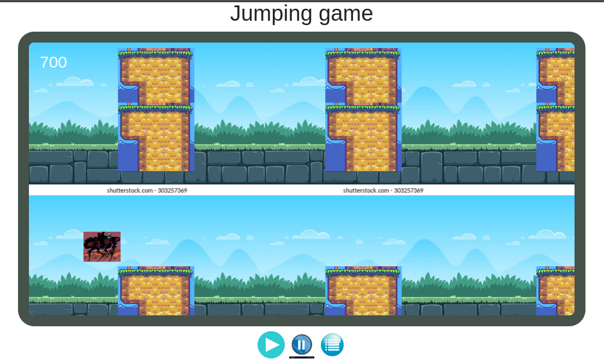
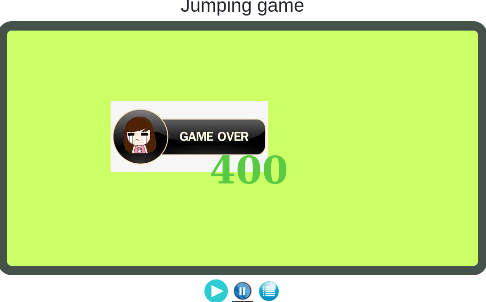
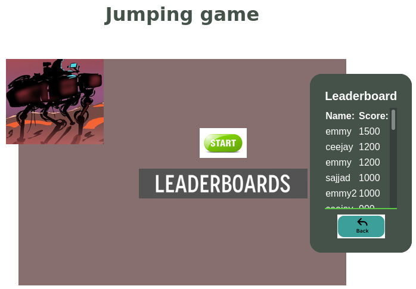

# Javascript Capstone Project (Jumping Game)

> This Game is built with HTML5, JAVASCRIPT and PHASER 3 and It is only compatible with screen bigger than 1024W at the moment. 

The goal is to try to go through the Objects without hitting any of them.

## ABOUT THE JUMPING GAME

* The first page contain the start and leader-board buttons, the start button is to start the game after filling the username of a player. You can also use leader-board button to check for user's score.

* The second page is has theree buttons, Play, Pause and Menu. Play button is to start the game, Pause is to stop or resume the game and menu is to check for game's menu.

* The last page has game interface with the moving objects and a man where a man is supposed to escape the moving object.

Use the below Keys to control the game

`Controls are simple, J Button to control an object and Button P to pause.` 




## 1. Getting Started: Additional description about the project and its features

This project is configured to be as simple as possible; build, deploy, and play with, all with npm.

## 2. Built With

- [EcmaScript 6.](https://www.w3schools.com/js/js_es6.asp)
- [Chrome web Browser.](https://www.google.com/chrome/?brand=CHBD&gclid=CjwKCAjwqJ_1BRBZEiwAv73uwMy_V_6pha6yTVEa8JtU5T51QdyxZOVnsXlRndK05hSO4bSM6muP5RoC2E4QAvD_BwE&gclsrc=aw.ds)
- [Github](https://www.github.com/) for deployment.
- [Webpack](https://webpack.js.org/) for bundling files.
- [Phaser 3](https://phaser.io/) - HTML5 framework.
- [Jest](https://jestjs.io/) framework for tests purposes.
- [HTML/DOM](https://www.w3schools.com/js/js_htmldom.asp) - Manipulation for UI.
- [Eslint](https://eslint.org/) for linter checks and style guides.
- [Leaderboard API service](https://www.notion.so/Leaderboard-API-service-24c0c3c116974ac49488d4eb0267ade3) for the scores' leaders board.

## 3. Pre-requisites

- A code editor (Vscode or Atom).
- A web Browser.
- Have NodeJS installed locally.
- Basic to intermediate JavaScript skills.

**Below are the instructions on how to play the game and also setting it up locally.**

### Build Dependencies 🚧

***The only dependencies are NodeJS & npm. Any NodeJS LTS version will work. Simply clone this repo and run npm install.***

- To get a local copy up and running, follow these simple example steps.

### Setup and installation

```
git clone https://github.com/Emmyn5600/Platform-game.git
```

### Install dependencies

```
npm install
```

### Play The Game 🕹️

Go to `dist/index.html` and run it with live-server.

### Run linter checks

```
npx eslint .
```

### Run tests

```
npm run test
```

### Deployment

|  APP NAME | BUILD STATUS: |
|   :---:   |    :---:     |
|**Jumping game** | [](https://emmyn5600.github.io/Platform-game/dist/) |

---

## 4. Game Development Guidelines & Timelines

| TIMELINE    |  TODO  |  DESCRIPTION  |    OUTCOME   |  STATUS   |
| :---        | :----: |    :----:     |    :----:    |  :----:   |
| Day 1       | Learn Phaser 3 framework | Obtain leads, knowledge and the syntax necessary for the development of the game.| Understanding the game framework.|&#9745;|
| Day 2       | Game Design | Design the game by defining the topic and objective of the game, the game mechanics, the different entities involved in the game (player, enemies, platforms, levels, etc.), the user interactions and finally the different screens (Phaser scenes) that needs implementation. |  Set objectives for remaining days. |&#9745;|
| Day 3       |Game Development| Game Development following the defined design|  Game Logic             |&#9745;|
| Day 4       |Game Development| Game Development following the defined design|  Game Interface         |&#9745;|
| Day 5       |Game Documentation| Game Documentation following the defined design|  Game Documentation |&#9745;|
---

## 5. Game Scenes & Their Work Descriptions

| SCENES           |                                                                 DESCRIPTION                                                                      |
| :---             |                                                                 :---                                                                             |
| **Boot**         | The first scene that is loaded by Phaser, and it will in turn load the `PreloaderScene`.                                                         |
| **Preloader**    | The second scene that is loaded after the `Boot`. It displays the progress bar while it loads all of the assets needed for the game.        |
| **aboutGame**    | This scene loads when the player presses play in the `Title`. It displays the instructions for the game and the mission ahead.              
| **Game**         | Contains the main logic for the game. Loads after the `about` loads.                                                                        |
| **GameOver**     | Displays the player's scores immediately the game is over and asks user to register their score after which is loads the `LeadersBoard`     |
| **LeadersBoard** | Displays the highscores and their owners. It loads immediately after the `GameOverScene`                                                         |
| **Menu**      | Contains settings for the players to be able to modify in the game (example: score).                                                        |
---

## 6. On more about the feel/look and what the game is all about

| SCENES              | SCREENSHOT |
| :----               |   :----:   |
| `about`        |            |
| `GameOver`     |      |
| `LeadersBoard` |  |
| `MenuScene`      |        |
---

## 7. Live Play

[Link to Live Play](https://emmyn5600.github.io/Platform-game/dist/)

---

## 8. Author Section

👤 **NSABIMANA Emmanuel**

- GitHub: [@emmyn5600](https://github.com/Emmyn5600)
- Twitter: [@NSABIMA62253884](https://twitter.com/NSABIMA62253884)
- LinkedIn: [@nsabimana-emmanuel-4276091b2](https://www.linkedin.com/in/nsabimana-emmanuel-4276091b2/)

---

## 9. 🤝 Contributing

Contributions, issues and feature requests are welcome!

Feel free to check the [issues page](https://github.com/Emmyn5600/Platform-game/issues).

---

## 10. Show your support

Give a ⭐️ if you like this project!

---

## 11. Acknowledgments & Credits

- Hat tip to anyone whose code, sprites/assets, ideas/advice, and knowledge was used.

---

### Credits

| Name  | Author | Source |
| :---- | :---- | :---:  |
| Platforms | phaser site | [phaser.io](https://phaser.io/) |


---

### Inspiration

This game was inspired by the [endless runner game](https://www.emanueleferonato.com/tag/endless-runner/) (5 parts tutorial). Inspiration was drawn to design a simple but creative game, and implement it using Phaser. Therefore, I did spend some time designing the game before programming it.

---

## Show your support

Give a ⭐️ if you like this project!

## Acknowledgments

- I would like to thank our code reviewer and anyone else who participated in making this done.

## 12. 📝 License

This project is [MIT](https://github.com/christianotieno/platform-game/blob/develop/LICENSE) licensed.

---
