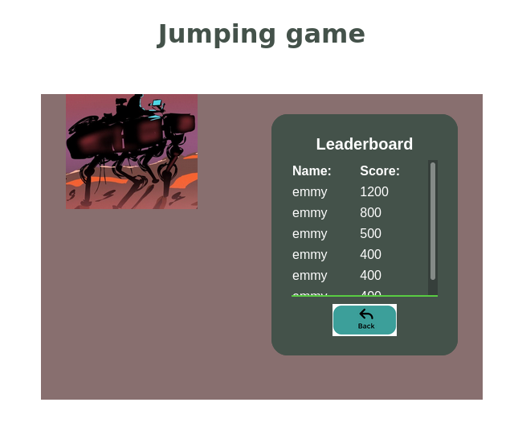

# Platform Game (name: Jumping Game)

This Game is built with HTML5, JAVASCRIPT and PHASER 3 and It is only compatible with screen bigger than 1024W at the moment. 

The goal is to try to go through the Objects without hitting any of them.

## ABOUT THE JUMPING GAME

* The first page contain the start and leader-board buttons, the start button is to start the game after filling the username of a player. You can also use leader-board button to check for user's score.

* The second page is has theree buttons, Play, Pause and Menu. Play button is to start the game, Pause is to stop or resume the game and menu is to check for game's menu.

* The last page has game interface with the moving objects and a man where a man is supposed to escape the moving object.

Use the below Keys to control the game

`Controls are simple, J Button to control an object and Button P to pause.` 

## Getting Started

- Clone this repo with.
  - Open your CMD and type `git clone https://github.com/Emmyn5600/Platform-game.git`

- Navigate to the project directory and install all packages.
  - In your CMD type `cd Platform-game`
  - and the `npm install` 

- Go to `dist/index.html` and run it with live-server.

- Now click on start button to start the game.

- Then start playing

- Note: Remeber to use J button to control an object  and Button P to pause.

## Built With

- HTML5
- CSS3
- JAVASCRIPT
- PHASER 3
- BOOTSTRAP

## Testing

Use `npm run test` to see the passing test.

## Live Demo

[Live Demo Link](https://emmyn5600.github.io/Platform-game/dist/)

## Authors

👤 **NSABIMANA Emmanuel**

- GitHub: [@emmyn5600](https://github.com/Emmyn5600)
- Twitter: [@NSABIMA62253884](https://twitter.com/NSABIMA62253884)
- LinkedIn: [@nsabimana-emmanuel-4276091b2](https://www.linkedin.com/in/nsabimana-emmanuel-4276091b2/)

## 🤝 Contributing

Contributions, issues, and feature requests are welcome!

Feel free to check the [issues page](https://github.com/Emmyn5600/Platform-game/issues).

## Show your support

Give a ⭐️ if you like this project!

## Acknowledgments

- I would like to thank our code reviewer and anyone else who participated in making this done.

## 📝 License

This project is [MIT](./LICENCE) licensed.
